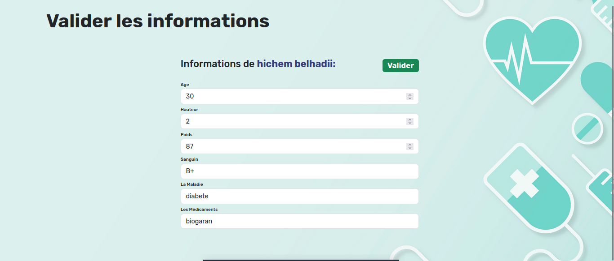

# Deitary AI 
Web Application For Follow-Up By Nutritionist And Appointment Booking, Contains Artificial  Intelligent Suggestion System
# Getting Started
## Prerequisites
Ensure that you have the following installed tools:
- Python
- MySQL
- XAMPP or WAMP ( if using phpmyadmin )
## Installation 
1- Clone the repository:
```
git clone https://github.com/haithembenhalima/dietary_ia.git
```
2- Install dependencies:
```
pip install -r requirements.txt
```
or with
```
pip install fastapi uvicorn pydantic sqlalchemy pymysql jinja2
```
## Usage
1- Create a .env file in the root directory and add the following environment variables:
```
DB_URL = "mysql+pymysql://root:@localhost:3306/nutritionist_db"
SESSION_SECRET_KEY= your session secret key
```
2- Create a `mysql` database using MySQL Workbench or phpmyadmin: 
```
create database nutritionist_db

```
3- Start the server:
```
uvicorn main:app --reload
```
Access the app at `http://localhost:${PORT}`

# Project Structure
```
.
├── analysis
│   ├── analyse4.pdf
│   ├── analyse4_comparison_decrease.csv
│   ├── analyse4_comparison_increase.csv
├── controllers
│   ├── admin_controller.py
│   ├── doctor_controller.py
│   ├── main_controller.py
│   ├── patient_controller.py
├── models
│   ├── analysis.py
│   ├── appointment.py
│   ├── notification.py
│   ├── patient.py
│   ├── user.py
├── pictures
├── recommandation_sys
│   ├── allplates.csv
│   ├── mixt.py
├── routes
│   ├── admin_routes.py
│   ├── doctor_routes.py
│   ├── main_routes.py
│   ├── patient_routes.py
├── schemas
│   ├── schemas.py
├── static
│   ├── css
│   ├── img
│   ├── js
├── tempalates
│   ├── admin
│   ├── doctor
│   ├── patient
│   ├── index.html
├── utils
│   ├── crud.py
├── .gitignore
├── database.py
├── main.py
└── requirements.txt
```

# Screenshots
## Login

  <div class="image-container">
        
  </div>
  
  ## Doctor
  
  <div class="image-container" style="display:flex; justify-content: center; gap:20px">
        
        
        
  </div>
  <div class="image-container" style="display:flex; justify-content: center; gap:20px">
        
        
        
  </div>
  <div class="image-container" style="display:flex; justify-content: center; gap:20px">
        
        
        
  </div>
    <div class="image-container" style="display:flex; justify-content: center; gap:20px">
        
        
        
  </div>

  ## Patient
    
  <div class="image-container" style="display:flex; justify-content: center; gap:20px">
        
        
        
  </div>
  <div class="image-container" style="display:flex; justify-content: center; gap:20px">
        
        
        
  </div>
  
# Licence

Project Rights Reserved for Students Team as a startup project:
- Mekid Manel
- Belkessa Narimen
- Bouzid Nosseiba
